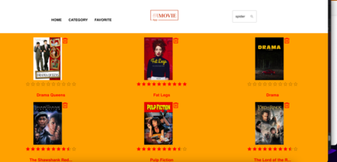
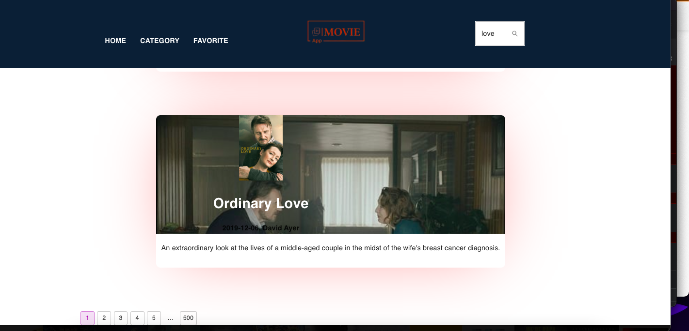

## Preview


# Reactflix Movies App - CWR

 Movies App to search movies, save movies to favorites, browse movies by categories to include several genres.

## Main Features:

- Consumes [TMDB](https://www.themoviedb.org/) APIs
- [Authentication](https://developers.themoviedb.org/3/getting-started/authentication) via The Movie Database API
- Browse movies by Category or Genres
- Pagination for all Movie Lists
- Movie Information Page crew/cast of Actors
- Search Movies by Title
- Add or Remove Movies to/from Favorites

### Tech Stack:
- [React JS](https://reactjs.org/docs/getting-started.html) v17.02 Bootstrapped with [Create React App](https://github.com/facebook/create-react-app).
- [Material UI](https://mui.com/material-ui/getting-started/installation/) 
- [Material Styles](https://mui.com/system/styles/basics/) 
- [Material Icons](https://mui.com/material-ui/material-icons/#main-content) 
- [Redux Toolkit](https://redux-toolkit.js.org/introduction/getting-started)
- [React-Redux](https://react-redux.js.org/introduction/getting-started)
- [React-Router V6](https://v6.reactrouter.com/web/guides/quick-start)
- [AXIOS](https://axios-http.com/docs/intro)
- [SWIPPER](https://swiperjs.com/react)

### Instructions:
#### 1. Clone this repository.
```bash
git clone https://github.com/effectiveone/MovieApp-redux-toolkit.git
```

#### 2. Go to the project directory.
```bash
cd react-redux-toolkit-movie-app
```
#### 3. Install dependencies
You will need to install the dependencies listed in the package.json
```
npm install
```
or
```
yarn install
```
#### 3. Setup Account with TMDB & ALAN
Go here [TMDB](https://www.themoviedb.org/signup?language=en-US) to set up a account then you will need to request a API KEY.


#### 4. Set Environment Variables
You'll need to set your TMDB API key in the environment variable file so your project runs correctly. Rename `.example.env` file to `.env` and place your TMDB API key there. Be sure to remove the '#' sign prepending the variable names.

#### 5. Run The App
To start the app 
```
npm start
```
or
```
yarn start
```

## Screenshots





## 👨‍💻 Connect with me 
mail: konrad.gruca90@gmail.com


